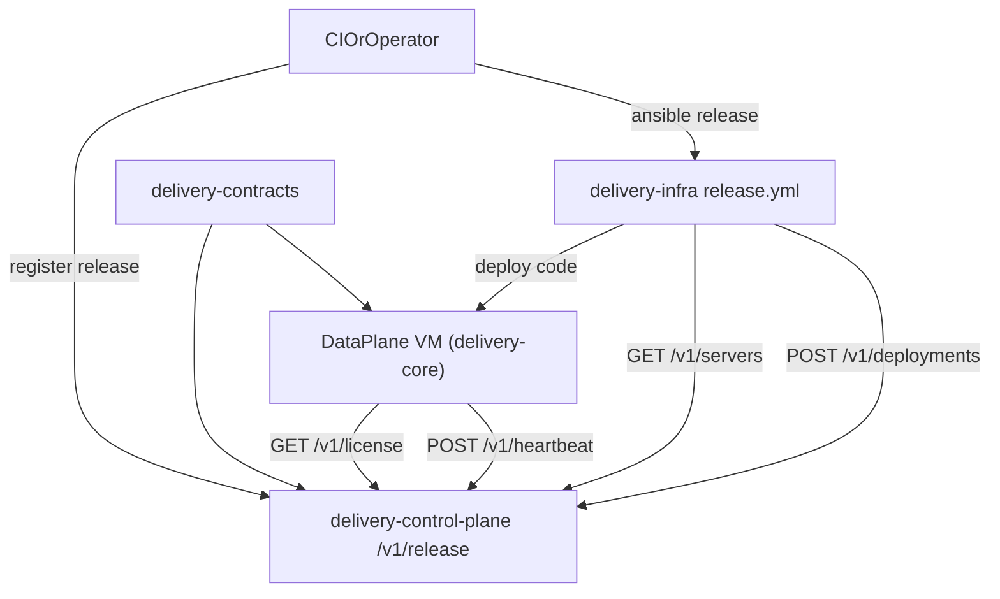

# PROJECT_LINEAR_BEGINNER_GUIDE

Максимально подробная линейная инструкция для новичка:
- как устроен проект сейчас;
- как папки взаимодействуют между собой;
- как поднять и проверить всё в проде;
- какие есть нюансы и типовые ошибки.

Документ написан по текущему состоянию репозитория (после Фазы 7).

---

## 0) Что это за проект простыми словами

Сейчас у вас **переходная архитектура**:

1. Есть новый split-контур:
   - `delivery-control-plane` (центр управления парком серверов),
   - `delivery-core` (data-plane ядро, которое крутится у каждого owner),
   - `delivery-contracts` (общие контракты между ними),
   - `delivery-infra` (Ansible, который всё разворачивает и обновляет).
2. Есть legacy `backend` (исторический монолит), который всё ещё лежит рядом и частично используется как переходный слой.

Критично: пока полный cutover не завершён, `backend` остаётся рабочим местом для тех продуктовых
доменов, которые ещё не перенесены в split-контур (меню, точки, заказы, самовывоз/доставка и часть
кастомизации). Это не “запрещённая папка”.

Если вы новичок: думайте так —
- **control-plane** = "диспетчер и реестр",
- **core** = "движок на сервере владельца",
- **infra** = "руки, которые ставят и выкатывают",
- **contracts** = "договор, чтобы все говорили на одном языке".

---

## 1) Карта репозитория (что за папки и зачем)

## 1.1 Схема (быстрый взгляд)

```text
/home/moont/dev/delivery
├── delivery-contracts        # Общие DTO/enum/schema-контракты
├── delivery-control-plane    # Control-plane API (register/license/heartbeat/release)
├── delivery-core             # Data-plane ядро (license client, heartbeat, healthz, custom DevX)
├── delivery-infra            # Ansible provision/deploy/release/rollback/hotfix
├── backend                   # Legacy монолит (исторический/переходный контур)
├── frontend                  # Отдельный Expo фронтенд (не в infra release-потоке)
└── PLAN_FLEET.md             # Главный стратегический план и статусы фаз
```

## 1.2 Таблица "папка -> роль -> с кем общается"

| Папка | Роль | Вход/выход |
|---|---|---|
| `delivery-contracts` | Источник публичных контрактов | Используют `delivery-core` и `delivery-control-plane` |
| `delivery-control-plane` | Реестр серверов, лицензий, релизов, аудита | Принимает `register`, `heartbeat`; отдаёт `license`, `release/latest`, `servers` |
| `delivery-core` | Приложение на сервере owner | Берёт лицензию из control-plane, шлёт heartbeat, обслуживает API владельца |
| `delivery-infra` | Развёртывание и раскатка | Клонирует core/control-plane, поднимает VM, делает release/rollback/hotfix |
| `backend` | Legacy/переходный слой | Держит исторический код, миграционные хвосты и legacy-доки |
| `frontend` | Клиентское приложение (Expo) | Не участвует в ansible release цепочке server-side |

---

## 2) Как компоненты взаимодействуют (по событиям)

## 2.1 Схема взаимодействия (mermaid)



## 2.2 Без схемы (человеческим языком)

1. Вы (или CI) публикуете новый release ref в `delivery-control-plane`.
2. `delivery-infra` берёт inventory хостов и запускает раскатку (canary -> bake -> production).
3. На каждом сервере:
   - создаётся новый release-каталог,
   - ставятся зависимости,
   - выполняется проверка совместимости overlay (`app:custom:check-compat`),
   - миграции,
   - кэш,
   - atomically переключается symlink `current`.
4. `delivery-core` на сервере потом:
   - получает лицензию (`/v1/license`),
   - шлёт heartbeat (`/v1/heartbeat`),
   - участвует в общей telemetry/аудите.

---

## 3) Какие API и команды важны

## 3.1 Control-plane API (обязательно знать)

- `POST /v1/register` — регистрация data-plane сервера.
- `GET /v1/license?server_token=...` — выдача лицензии.
- `POST /v1/heartbeat` — heartbeat от data-plane.
- `POST /v1/release` — регистрация нового core release.
- `GET /v1/release/latest` — latest release (важно для drift/pull-стратегий).
- `POST /v1/deployments` — аудит rollout/hotfix/rollback.
- `GET /v1/servers` — inventory для dynamic plugin.
- `POST /v1/auth/token` — выдача JWT.

## 3.2 Ключевые консольные команды в `delivery-core`

- `php bin/console app:license:refresh`
- `php bin/console app:fleet:heartbeat`
- `php bin/console app:custom:new <owner_slug>`
- `php bin/console app:custom:doctor`
- `php bin/console app:custom:check-compat`

---

## 4) Как устроен прод-поток в infra

## 4.1 Основные playbook-ы

- `playbooks/control-plane-provision.yml` — первичная подготовка control-plane VM.
- `playbooks/control-plane-deploy.yml` — раскатка control-plane.
- `playbooks/provision.yml` — первичная подготовка data-plane VM.
- `playbooks/release.yml` — canary -> bake -> production.
- `playbooks/rollout.yml` — выкладка на группу data-plane.
- `playbooks/hotfix.yml` — быстрый production rollout.
- `playbooks/rollback.yml` — откат на предыдущий release.
- `playbooks/custom-deploy.yml` — обновление только overlay.
- `playbooks/drift-check.yml` — проверка расхождения версий.

## 4.2 Inventory-источник (очень важный нюанс)

Используется `-i inventory/production`, это гибрид:
- dynamic plugin: `inventory/production/control_plane.yml`,
- static fallback: `inventory/production/hosts.yml`.

Если API control-plane недоступен, ansible предупреждает и падает на fallback inventory.

---

## 5) Полный линейный запуск "с нуля до прода"

Ниже поток специально в формате "делай 1, потом 2, потом 3", без прыжков.

## 5.1 Предварительные условия

На машине оператора (где запускаете ansible):
- Linux/macOS shell;
- `git`, `python3`, `pip`;
- доступ по SSH к target VM;
- доступ к репозиториям (`delivery-core`, `delivery-control-plane`, `delivery-contracts`, overlay repo);
- DNS уже делегирован.

На VM:
- Debian/Ubuntu-подобная ОС (роли заточены под apt-family);
- открыты порты под HTTP/HTTPS;
- есть sudo-доступ для bootstrap.

## 5.2 Подготовка конфига infra

1. Перейдите в infra:

```bash
cd /home/moont/dev/delivery/delivery-infra
```

2. Установите коллекции:

```bash
ansible-galaxy collection install -r collections/requirements.yml
```

3. Проверьте `inventory/production/group_vars/all/vars.yml`:
   - `core_repo`, `control_plane_repo`, `contracts_repo`
   - `control_plane_url`
   - `release_ref`, `cp_release_ref`
   - `rollout_serial`, `canary_serial`, `hotfix_serial`
   - `release_bake_seconds`

4. Проверьте host vars:
   - `inventory/production/host_vars/control-plane.yml`
   - `inventory/production/host_vars/<owner>.yml` (пример: `test-owner.yml`)

5. Подготовьте и зашифруйте vault:
   - `inventory/production/group_vars/all/vault.yml`

Важно: **секреты только в vault/shared env**, не в git.

## 5.3 Локальная валидация до боевого запуска

```bash
cd /home/moont/dev/delivery/delivery-infra
ansible-playbook --syntax-check playbooks/control-plane-provision.yml
ansible-playbook --syntax-check playbooks/control-plane-deploy.yml
ansible-playbook --syntax-check playbooks/provision.yml
ansible-playbook --syntax-check playbooks/release.yml
ansible-playbook --syntax-check playbooks/rollout.yml
ansible-playbook --syntax-check playbooks/rollback.yml
ansible-playbook --syntax-check playbooks/hotfix.yml
ansible-playbook --syntax-check playbooks/drift-check.yml
ansible-playbook --syntax-check playbooks/custom-deploy.yml
ansible-lint playbooks/*.yml roles/*/tasks/main.yml
```

Dry-run:

```bash
ansible-playbook -i inventory/production playbooks/provision.yml --check \
  -e "ansible_become=false app_root=/tmp/delivery-app-local base_manage_packages=false app_clone_overlay=false provision_run_initial_deploy=false postgres_managed=true"

ansible-playbook -i inventory/production playbooks/release.yml --check \
  -e "ansible_become=false app_root=/tmp/delivery-app-local deploy_skip_healthcheck=true core_repo=https://github.com/git/git release_ref=master"
```

## 5.4 Прод: bootstrap control-plane

1. Подготовка VM:

```bash
ansible-playbook -i inventory/production playbooks/control-plane-provision.yml -l control-plane
```

2. Раскатка control-plane:

```bash
ansible-playbook -i inventory/production playbooks/control-plane-deploy.yml \
  -e "cp_release_ref=<tag_or_commit>"
```

3. Проверка control-plane API:
- `GET /v1/servers` (может быть пусто до onboarding owner),
- `GET /v1/release/latest` (после регистрации release),
- логика `register/license/heartbeat` доступна.

## 5.5 Прод: onboarding owner (data-plane)

1. Создайте owner в CP (slug/domain/operator).
2. Подготовьте overlay локально в `delivery-core`:

```bash
cd /home/moont/dev/delivery/delivery-core
php bin/console app:custom:new <owner_slug>
php bin/console app:custom:doctor
php bin/console app:custom:check-compat
```

3. Проверьте owner host vars (`owner_slug`, `server_domain`, `custom_repo`, `pinned_ref`).
4. Provision data-plane:

```bash
cd /home/moont/dev/delivery/delivery-infra
ansible-playbook -i inventory/production playbooks/provision.yml -l <owner_host>
```

Что делает provision:
- создаёт `deploy` user и каталоги;
- поднимает postgres (или использует managed DB);
- вызывает `POST /v1/register`;
- пишет `OWNER_ID`, `WORKSPACE_ID`, `SERVER_TOKEN` в `shared/.env`.

## 5.6 Прод: release-поток core

1. Запустить release (canary -> bake -> production):

```bash
ansible-playbook -i inventory/production playbooks/release.yml \
  -e "release_ref=<tag_or_commit>"
```

2. Поведение на хосте:
- новый release в `/opt/app/releases/<id>`;
- symlink на `shared/custom`, `shared/var`, `shared/.env`;
- `composer install --no-dev`;
- `app:custom:check-compat`;
- миграции;
- `cache:clear`, `cache:warmup`;
- переключение `current`;
- healthcheck;
- аудит в control-plane deployments.

3. Проверить после раскатки:

```bash
curl -fsS https://<server_domain>/healthz
```

И дополнительно:
- `current` указывает на новый release;
- `/v1/servers` показывает heartbeat;
- `/v1/deployments` содержит rollout audit.

## 5.7 Прод: обычные операционные команды

Только owner overlay:

```bash
ansible-playbook -i inventory/production playbooks/custom-deploy.yml -l <owner_host>
```

Экстренный hotfix:

```bash
ansible-playbook -i inventory/production playbooks/hotfix.yml \
  -e "release_ref=<tag_or_commit>"
```

Ручной rollback:

```bash
ansible-playbook -i inventory/production playbooks/rollback.yml -l <owner_host>
```

Проверка drift:

```bash
ansible-playbook -i inventory/production playbooks/drift-check.yml
```

---

## 6) Важные нюансы (где чаще всего ошибаются)

1. **Inventory запускать как `-i inventory/production`, а не только `hosts.yml`**  
   Иначе вы обходите dynamic plugin.

2. **Не держите `deploy_skip_healthcheck=true` в бою**  
   Это значение удобно для local/dev, но в проде healthcheck должен быть включён.

3. **Overlay несовместим -> хост будет пропущен**  
   Это штатная защита, не “поломка ansible”.

4. **`pinned_ref` реально блокирует обновление хоста на latest**  
   Если “один owner не обновляется”, первым делом проверяйте pin.

5. **Секреты не должны жить в git**  
   Только vault и `shared/.env` на сервере.

6. **Legacy `backend` и split-сервисы живут рядом**  
   Не путайте команды: для server rollout сейчас используйте `delivery-infra + delivery-core/control-plane`.

7. **Миграции ядра и кастома разделены**  
   Кастомные миграции в `custom/migrations` (`Custom\Migrations`), не смешивайте namespace.

---

## 7) Что проверять в CI/CD

Минимально:
- контракты (`delivery-contracts` + compat checks),
- backend checks (container/schema/boundary/contract tests),
- `delivery-core` checks (lint + `app:custom:*` smoke),
- release stage (manual/controlled) перед production.

---

## 8) Быстрая шпаргалка "если совсем с нуля"

1. Настроить `vars.yml` + `host_vars/*` + `vault.yml`.
2. Прогнать syntax-check и ansible-lint.
3. `control-plane-provision.yml`.
4. `control-plane-deploy.yml`.
5. В `delivery-core`: `app:custom:new`, `doctor`, `check-compat`.
6. `provision.yml -l <owner>`.
7. `release.yml`.
8. Проверить `/healthz`, `/v1/servers`, deployments audit.
9. Для изменений только overlay — `custom-deploy.yml`.
10. Для аварии — `hotfix.yml` / `rollback.yml`.

---

## 9) Детальная проверка прода (чеклист после запуска)

Ниже последовательность проверок, которую можно выполнять после каждого релиза.

### 9.1 Проверка control-plane API

```bash
# latest релиз
curl -fsS "https://<control_plane_domain>/v1/release/latest"

# серверы (нужен API токен инвентаря/оператора)
curl -fsS "https://<control_plane_domain>/v1/servers" \
  -H "Authorization: Bearer <cp_inventory_api_token>"
```

Что проверяем:
- `release/latest` возвращает ожидаемый `ref`;
- в `/v1/servers` есть нужный host;
- у host обновились `core_ref`/время heartbeat.

### 9.2 Проверка data-plane на owner-хосте

```bash
# публичный health
curl -fsS "https://<owner_domain>/healthz"
```

На самом сервере:

```bash
readlink -f /opt/app/current
ls -la /opt/app/releases
```

Что проверяем:
- `healthz` = HTTP 200;
- `current` указывает на свежий release;
- старые релизы очищаются по `keep_releases`.

### 9.3 Проверка совместимости overlay после обновления

На data-plane сервере (под deploy-пользователем):

```bash
cd /opt/app/current
php bin/console app:custom:check-compat
```

Ожидаем `OK: ядро ... совместимо ...`.

### 9.4 Проверка аудита раскатки

Проверить, что в control-plane есть запись deployment:
- `kind`: `rollout` / `hotfix` / `rollback`;
- `target_host`: ваш owner host;
- `status`: `success`.

Если статуса нет — смотреть вывод ansible и доступность `/v1/deployments`.

### 9.5 Что делать при красном релизе

1. Сразу зафиксировать, где сбой:
   - compat-gate,
   - миграции,
   - healthcheck,
   - сеть/control-plane.
2. Для быстрых инцидентов:
   - `hotfix.yml` если есть исправленный ref,
   - `rollback.yml` если надо мгновенно вернуть предыдущее состояние.
3. После стабилизации:
   - прогнать `drift-check.yml`,
   - убедиться, что парк снова синхронизирован.

---

## 10) Ссылки на первоисточники в репозитории

- `PLAN_FLEET.md` (главный статус и архитектурные решения)
- `delivery-infra/README.md`
- `delivery-infra/docs/QUICK_FLOW.md`
- `delivery-infra/docs/INFRA_LINEAR_SCHEME.md`
- `delivery-infra/runbooks/LOCAL_VALIDATION.md`
- `delivery-infra/runbooks/RB-06_ONBOARD_OWNER.md`
- `delivery-control-plane/docs/API_V1.md`
- `delivery-control-plane/docs/CUTOVER_PHASE6.md`
- `delivery-core/README.md`
- `delivery-core/docs/OWNER_OVERLAY_GOLDEN_PATH.md`
- `delivery-core/docs/MIGRATION_FROM_BACKEND.md`

---

## 11) Границы этого документа

Этот документ покрывает текущий production-поток server-side (core/control-plane/infra).  
`frontend` (Expo) — отдельный контур с собственным lifecycle и не участвует напрямую в ansible release цепочке серверов.

